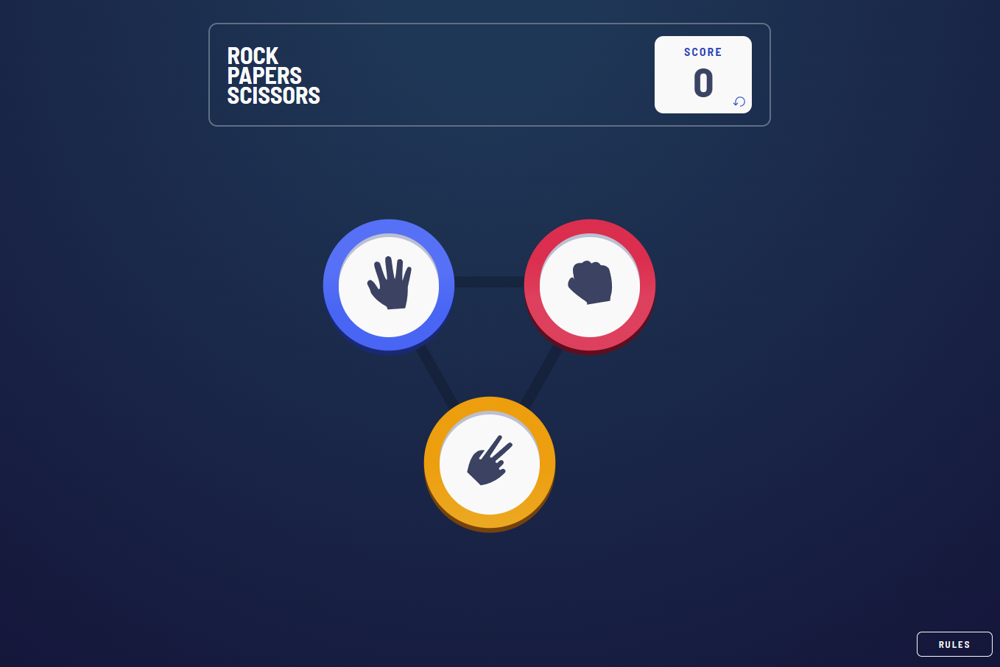
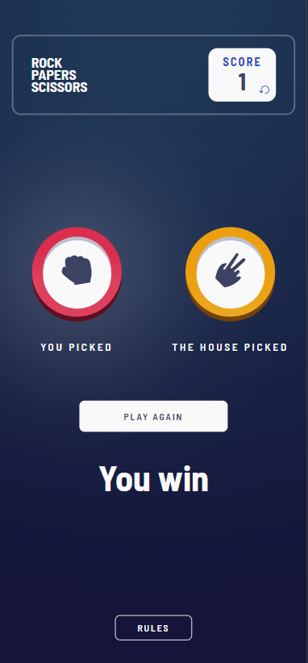

# **Frontend Mentor - Rock, Paper, Scissors**

Challenge do Frontend Mentor para a criação de um jogo de Pedra, Papel e Tesoura.

 

 

 

# **📄 Sobre a aplicação**

Para completar o desafio, era preciso seguir o design mobile e desktop, criar a lógica do jogo, replicar com CSS o design das fichas e incluir incluindo um modal para mostrar as regras do jogo.   
Opcionalmente, poderíamos fazerem persistir os pontos do usuário com o reload da página. Tomei a liberdade de criar algumas animações para mostrar o usuário vencedor e uma "roleta" que mostrasse visualmente ao jogador a escolha da ficha selecionada pela Casa (o computador).

A aplicação foi desenvolvida em React (com Vite).

 

 

# **🌎 Acesso**

A aplicação está hospedada no Netlify e pode ser acessada neste [link](https://gpg-rock-paper-scissors.netlify.app/).
